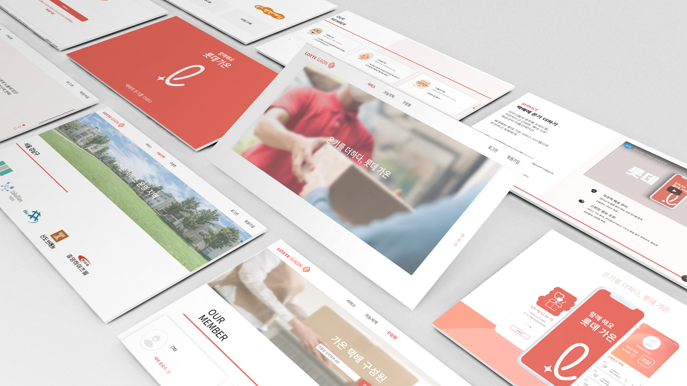

# lotte_project

## 롯데가온, 온기를 더하세요

#### ✅ 아파트단지/동네를 범위로 한 실버택배 서비스입니다.

#### ✅ 양질의 노인 일자리 창출 & 코로나로 인한 택배원들의 살인적인 업무량 완화

#### ✅ 사회적 가치를 실현하는 CSV 모델을 제시합니다

#### ✅ 개발플랫폼: ios/android/web (앱/웹 데이터 연동 & 통합)

#### ✅ 가온 웹페이지 :[link](http://ec2-3-129-71-199.us-east-2.compute.amazonaws.com:8000) 👈🏻

#### ✅ 서비스 소개영상 :[link](https://www.youtube.com/watch?v=jCzHUarGsbA&feature=youtu.be) 👈🏻

## 추가정보

#### ℹ️ 가온 앱 git repository [link](https://github.com/hojuniii/lotte_gaon_app) 👈🏻

#### ℹ️ 앱의 QR스캔을 통해 원터치로 택배를 접수하고, 택배정보/ 배송내역을 확인 수 있습니다.

#### ℹ️ 테스트용 QR코드는 웹 로그인 후, 상단 QR링크에서 확인할 수 있습니다.

#### ℹ️ 개인정보 문제로 롯데측의 택배정보를 받지 못해, 택배 모델을 직접 구현했습니다.

#### ℹ️ 앱/웹 데이터의 연동 & 통합

#### ℹ️ (앱 - 서버) 토큰인증을 사용한 사용자인증/자동로그인 구현
